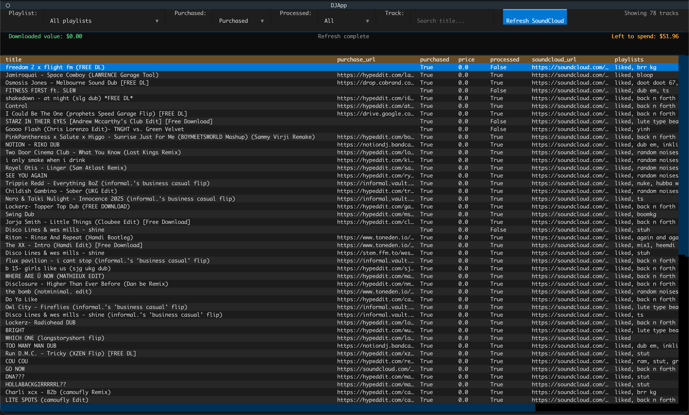
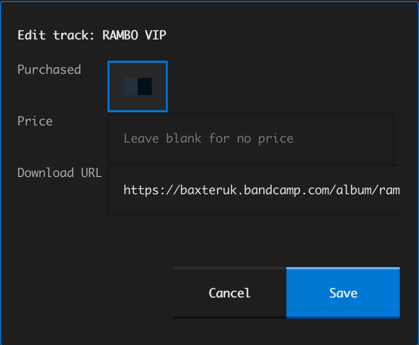

# Soundcloud Collection Tracker

## Overview

One of the biggest pain points for me as a DJ is keeping track of which tracks I've purchased, how much I've spent, and which tracks I still want to buy. I have a large collection of tracks on SoundCloud, but the platform doesn't provide an easy way to manage this metadata or see aggregated stats. This project allows me to automate the process of syncing my SoundCloud collection, maintaining a local dataset of tracks, and providing a terminal UI to manage purchase metadata and see spending stats at a glance.

## Screenshots

Homescreen:

Track edit modal:

## Technical Details

### Tech Stack

- **Language:** Python 3
- **DataFrame engine:** `polars`
- **HTTP client:** `requests`
- **Environment variable loading:** `python-dotenv`
- **Terminal UI framework:** `textual`

### Project Structure

- `soundcloud_flow.py`: Handles OAuth + SoundCloud API sync and writes normalized track data to parquet.
- `djapp.py`: Textual UI for browsing, filtering, editing, and refreshing track metadata.
- `data/tracks.parquet`: Primary persisted dataset used by the app (local only).

### Auth and Sync Flow (`soundcloud_flow.py`)

- Uses **OAuth 2.0 Authorization Code + PKCE**.
- Generates `code_verifier` / `code_challenge`, opens the authorize URL, and listens on `http://localhost:8000/callback` for the auth code.
- Exchanges auth code for access + refresh tokens via `https://secure.soundcloud.com/oauth/token`.
- Calls `/me` to resolve the authenticated user ID.
- Fetches:
  - Liked tracks (`/users/{user_id}/likes/tracks`)
  - Playlists (`/users/{user_id}/playlists`)
- Handles pagination through `next_href` while collecting tracks.

### Data Model

Tracks are stored in `data/tracks.parquet` with fields including:

- `id` (track id)
- `title`
- `artist`
- `genre`
- `soundcloud_url`
- `purchase_url`
- `purchased` (boolean)
- `price` (nullable float)
- `processed` (boolean)
- `playlists` (comma-separated labels)

### Processed Rule

Both scripts enforce the same rule:

- A track is `processed = true` only when:
  - `price` is not null
  - `purchase_url` is non-empty

### UI Behavior (`djapp.py`)

- Loads `data/tracks.parquet` at startup.
- Auto-refreshes SoundCloud data on mount by invoking `soundcloud_flow.py`.
- Provides filters for:
  - Playlist
  - Purchased status
  - Processed status
  - Track title text search
- Supports inline editing per track (purchased, price, download/purchase URL).
- Persists edits back to parquet immediately.
- Opens URL cells in browser when selected.

### Aggregated Counters

The app computes and displays:

- **Downloaded value:** sum of prices where `purchased == true`
- **Left to spend:** sum of prices where `purchased == false`

### Environment Requirements

Create a `.env` file with:

- `CLIENT_ID`
- `CLIENT_SECRET`

These are required by `soundcloud_flow.py` to authenticate against SoundCloud.
