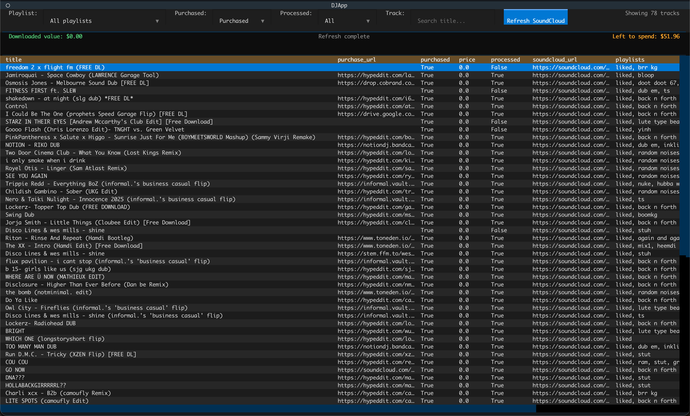
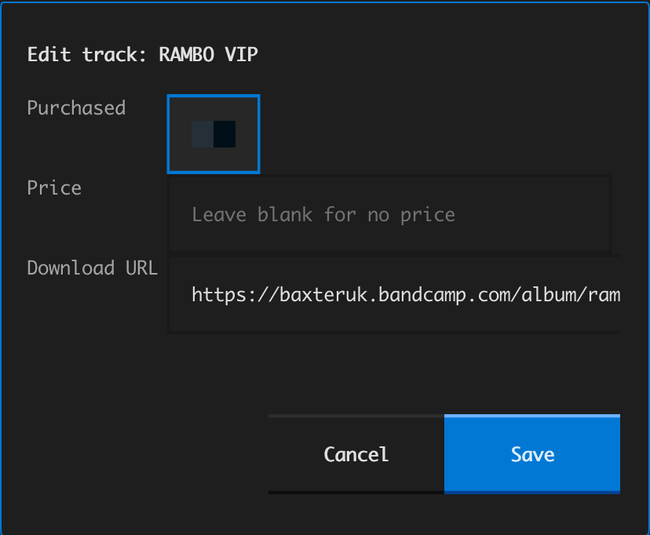

# Soundcloud Collection Tracker

## Overview

One of the biggest pain points for me as a DJ is keeping track of which tracks I've purchased, how much I've spent, and which tracks I still want to buy. I have a large collection of tracks on SoundCloud, but the platform doesn't provide an easy way to manage this metadata or see aggregated stats. This project allows me to automate the process of syncing my SoundCloud collection, maintaining a local dataset of tracks, and providing a terminal UI to manage purchase metadata and see spending stats at a glance.

## Screenshots

Homescreen:



Track edit modal:


## Technical Details

### Tech Stack

- **Language:** Python 3
- **DataFrame engine:** `polars`
- **HTTP client:** `requests`
- **Environment variable loading:** `python-dotenv`
- **Terminal UI framework:** `textual`

### Project Structure

- `soundcloud_flow.py`: Handles OAuth + SoundCloud API sync and writes normalized track data to parquet.
- `djapp.py`: Textual UI for browsing, filtering, editing, and refreshing track metadata.
- `data/tracks.parquet`: Primary persisted dataset used by the app (local only).

### Auth and Sync Flow (`soundcloud_flow.py`)

- Uses **OAuth 2.0 Authorization Code + PKCE**.
- Generates `code_verifier` / `code_challenge`, opens the authorize URL, and listens on `http://localhost:8000/callback` for the auth code.
- Exchanges auth code for access + refresh tokens via `https://secure.soundcloud.com/oauth/token`.
- Calls `/me` to resolve the authenticated user ID.
- Fetches:
  - Liked tracks (`/users/{user_id}/likes/tracks`)
  - Playlists (`/users/{user_id}/playlists`)
- Handles pagination through `next_href` while collecting tracks.

### Data Model

Tracks are stored in `data/tracks.parquet` with fields including:

- `id` (track id)
- `urn` (stable SoundCloud track identifier)
- `title`
- `artist`
- `genre`
- `isrc`, `duration_ms`, `bpm`, `key_signature`, `tag_list`, `label_name`, release date
- engagement counts (`playback_count`, `favoritings_count`, `reposts_count`, `comment_count`, `download_count`)
- `soundcloud_url`
- `purchase_url`
- `purchased` (boolean)
- `price` (nullable float)
- `processed` (boolean)
- `playlists` (comma-separated labels)

### Processed Rule

Both scripts enforce the same rule:

- A track is `processed = true` only when:
  - `price` is not null
  - `purchase_url` is non-empty

### UI Behavior (`djapp.py`)

- Loads `data/tracks.parquet` at startup.
- Auto-refreshes SoundCloud data on mount by invoking `soundcloud_flow.py`.
- Provides filters for:
  - Playlist
  - Purchased status
  - Processed status
  - Track title text search
- Supports inline editing per track (purchased, price, download/purchase URL).
- Persists edits back to parquet immediately.
- Opens URL cells in browser when selected.

### Aggregated Counters

The app computes and displays:

- **Downloaded value:** sum of prices where `purchased == true`
- **Left to spend:** sum of prices where `purchased == false`

### Environment Requirements

Create a `.env` file with:

- `CLIENT_ID`
- `CLIENT_SECRET`

These are required by `soundcloud_flow.py` to authenticate against SoundCloud.

## DJ music library

`src/library_ingest.py` maintains a single canonical copy of each downloaded
track in `~/Documents/media/dj/_library` and creates hard links in every
matching SoundCloud playlist folder. The `liked` source never gets a folder.
Hard links have no additional audio-file cost, but require `_library` and the
playlist folders to remain on the same volume (the default layout does).

After syncing SoundCloud once so `data/tracks.parquet` is current, create the
folders:

```sh
uv sync
uv run python -m src.library_ingest init
```

Drop audio files in `~/Documents/media/dj/_inbox`, then first inspect the
proposed automatic matches without moving anything:

```sh
uv run python -m src.library_ingest ingest --dry-run
```

Run the real ingest with `--review` to choose among the top candidates for
every uncertain file. Press Enter to leave a file in `_inbox`.

```sh
uv run python -m src.library_ingest ingest --review
```

The same review flow is available in the TUI. Use the **Ingestion** button on
the track-review page, select an inbox file, inspect its five ranked matches,
and choose `Ingest #1` through `Ingest #5`. The current track-review page
continues to manage purchase/download details separately. Ingesting a file
marks its matched track as both purchased and processed (handled/downloaded).

When none of those candidates is correct, use **Manual search** on the
ingestion page to search every synced track by artist or title, select a result,
then choose **Ingest manual selection**.

For a download with no SoundCloud track, select the inbox file, choose one or
more entries under **No SoundCloud match?**, and choose **Ingest selected
playlists**. The file is stored in `_library` and hard-linked into those
playlist folders without changing SoundCloud purchase or processing metadata.

Only a match scoring at least 94% and at least 8 percentage points ahead of
the runner-up is automatic. Exact embedded ISRC matches are accepted directly.
The matcher uses embedded artist/title and duration metadata first and uses a
filename only as a fallback. Your manual selections are stored in
`data/library_manifest.json`, keyed by the audio file SHA-256 and SoundCloud
URN. To continuously process only high-confidence files, run:

```sh
uv run python -m src.library_ingest watch
```
